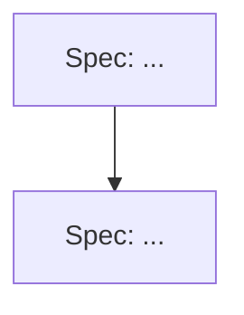

<!-- Epics define WHAT and WHY. No code, no detailed requirements (those go in child specs). Diagrams over prose. -->

## Vision

<!-- One to two sentences: the outcome this epic delivers and for whom. -->

## Motivation

<!-- Why now? What problem does this solve for mod authors or players? What happens if we do nothing? -->

## Scope

### In Scope

<!-- Bullet list of what this epic covers. -->

### Out of Scope

<!-- Explicit exclusions -- things that might seem related but are deferred or not our problem. -->

## Success Criteria

<!-- Measurable outcomes. Each criterion should be verifiable after the child specs ship. -->

- [ ]
- [ ]

## Child Specs

<!-- One line per child spec. Check boxes are filled in as specs are created and linked. -->

- [ ] Spec: <!-- brief name and one-liner -->
- [ ] Spec: <!-- brief name and one-liner -->

## Dependency Graph

<!-- Show which specs must complete before others can start. -->

## Open Questions

<!-- Unresolved decisions that must be answered before or during spec writing. -->

1.
