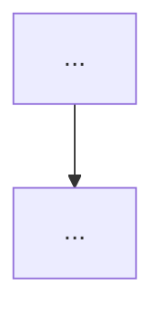

<!-- Specs define HOW. Every FR must be testable. Keep the public Content.* API minimal; do not complect Content/ with Core/. -->

## Parent Epic

<!-- Link the parent epic: #N -->

## Executive Summary

<!-- One paragraph: what this spec delivers, why it belongs in FTK, and the expected impact on mod authors or gameplay. -->

## Problem Statement

<!-- The concrete problem being solved. Include context from decompilation findings or known modding friction if relevant. -->

## Goals and Success Metrics

| Goal | Metric | Target |
|------|--------|--------|
|      |        |        |

## Functional Requirements

### FR-1: <!-- Name -->

**Description**: <!-- What the system must do. -->
**Acceptance Criteria**:
- [ ]
**Priority**: P0 / P1 / P2

<!-- Add FR-2, FR-3, ... as needed. -->

## Non-Functional Requirements

### NFR-1: <!-- Name -->

**Category**: Performance / Reliability / Compatibility / Maintainability
**Requirement**: <!-- Specific and measurable. -->
**Rationale**: <!-- Why this matters for a BepInEx/HarmonyX mod. -->

## Technical Architecture

<!-- Mermaid diagram showing component relationships or data flow. -->

### Key Types and Data

| Type / Field | Kind | Description / Constraints |
|-------------|------|--------------------------|
|             |      |                          |

## Simplicity Constraints

<!-- Architectural guardrails. What patterns are forbidden? What must stay out of Core/? -->

## Edge Cases and Error Handling

| Scenario | Expected Behavior |
|----------|------------------|
|          |                  |

## Dependencies and Risks

| Item | Impact | Mitigation |
|------|--------|-----------|
|      |        |           |

## Implementation Phases

### Phase 1: <!-- Name -->

**Goal**: <!-- What this phase achieves. -->
**Tasks**:
- [ ]

<!-- Add Phase 2, Phase 3, ... as needed. -->

## Open Questions

<!-- Items that must be resolved before or during implementation. -->

1.
