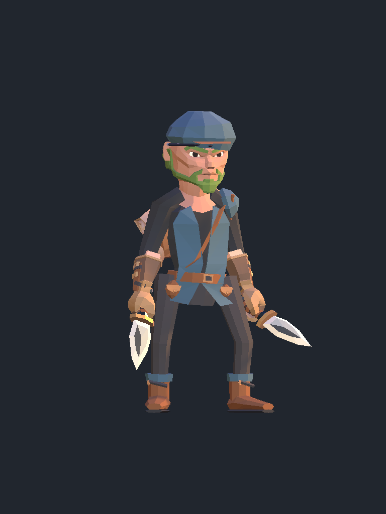
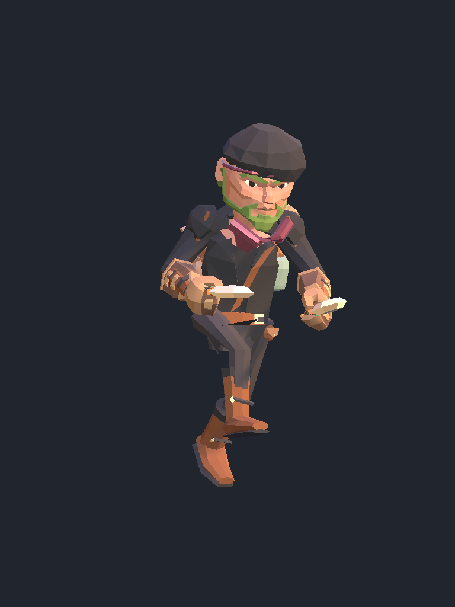
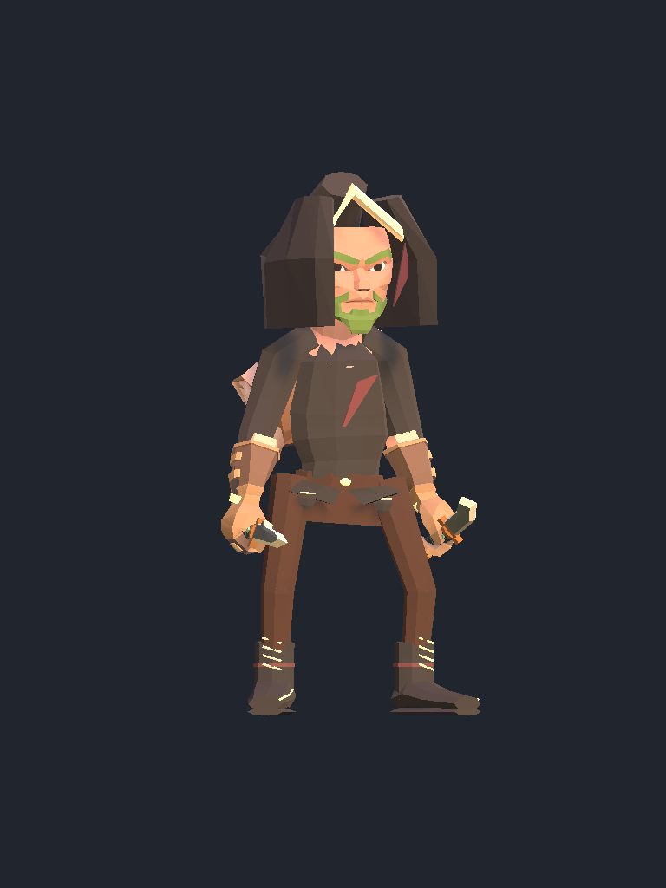

# Thief art redesign: native review

The Thief now uses a compact cloth cap and lowered cowl, a layered vest, diagonal leather strap, visible belt and pouches, shaped bracers and cuffed boots. Street has a short cap peak and slate blue clothing. Nightblade uses charcoal cloth and a wine neck wrap. The paired daggers were redesigned separately for readability.

These are unedited captures of the actual native Treasure Hunter male avatar with the original equipment installed. Native face, hair, ears and backpack remain game-owned. The selected cap intentionally leaves side hair visible. These images are not an offline mannequin or concept illustration.

## Final Street outfit: native idle

The final exported Street equipment was inspected from the front, three-quarter, side and back in native idle. The cap crown is clear in these sampled views. This does not establish other avatars or every animation.

[Front](street-male-front.png), [side](street-male-side.png), [back](street-male-back.png).

## Final Nightblade outfit: native locomotion frames

The final crown-clearance assets were inspected on the same male chassis during native locomotion. The movement state remained `Tracking`, so these are sampled moving poses, not idle or combat evidence. The crown has no obvious scalp break in the sampled views. The Nightblade loadout was a disposable starting-item fixture.

[Front](nightblade-male-front.png), [side](nightblade-male-side.png), [back](nightblade-male-back.png).

## Rejected original

The prior fitting pass was not acceptable art. Its block hood and plain torso are retained only as a before comparison.

The raised-hood redesign experiments also remained too bulky in profile. Their source and native comparison record are preserved under `../review/redesign/raised-hood-rev6/` and `../review/redesign/nightblade-hood-rev6.json`. They are superseded by the compact cap/cowl exports.

## Provenance and limits

[native-review.json](native-review.json) records exact capture IDs, unedited image hashes, equipment ownership, framework/helper binary hashes, and the frozen male apparel/palette hashes. Deployed asset hashes were compared with the package. Raw receipts and bulk captures remain in ignored scratch; the ledger contains no personal filesystem paths or saves.

The editable apparel source is `../ranged-apparel/redesign.py`, called by `../ranged-apparel/build.py`. Source, exported GLBs, icons, palette and package provenance are current. Independent offline validation passed for 119 GLBs, 35 icons and 155 package assets. These checks establish file and surface validity, not native gameplay acceptance.

Female and alternate body/race profiles, other progression tiers, final Nightblade stationary idle, ordinary combat attack/hit motion, complete animation intervals, culling, equipment rebuilds, resource lifetime, bow draw and loot displays remain separate gates. Native color and material appearance should be judged from these game captures, not from the icon renderer.
