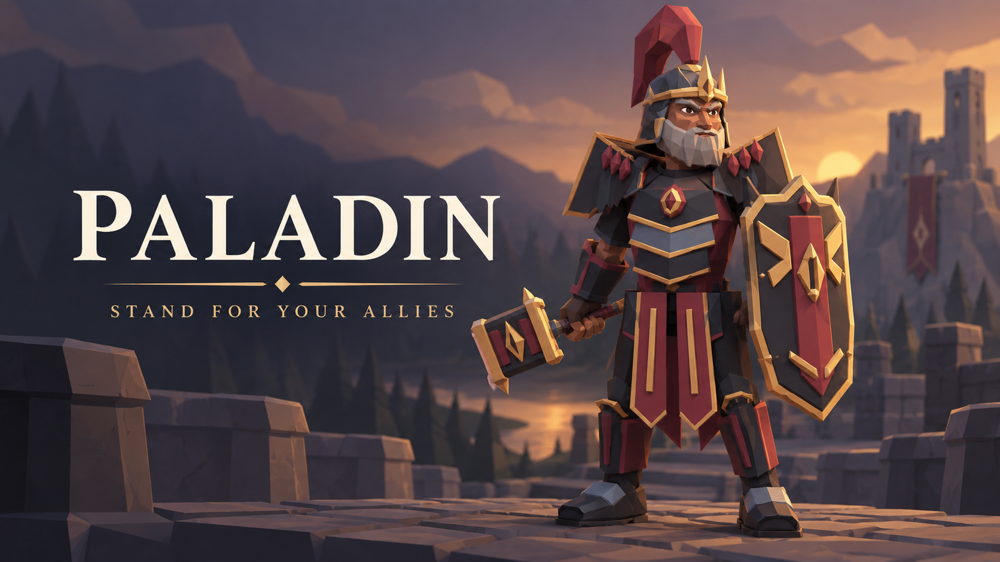

# Paladin

## Hero banner

`promo/paladin-censure-banner.png` is original promotional illustration. It depicts the fully equipped Censure set and is not an in-game screenshot. The production listing should use it as the first hosted preview image after review.

The unpublished local draft uses a reserved release-shaped preview URL and seeds the banner into the player's marketplace image cache during local setup. That URL is not published or downloadable. Replace it with the immutable hosted release asset URL for a public catalog entry.

## Card copy

**Stand between danger and your party.**

Choose the Paladin, a Vitality-led protector built around a guaranteed Guard action, a once-per-combat rescue from lethal direct damage, and a complete original hammer, shield and armor progression.

## Full listing

The Paladin is a frontline protector for *For The King*. Guard a chosen ally to reduce qualifying direct attack damage by 50% until your next turn. A focused attack restores the marked ally, and Divine Intervention leaves that ally at 1 HP when an eligible direct hit would otherwise be lethal.

Build from plain Novice gear into Oathkeeper, Highward, Mercy, Censure and Verdict sets. The package includes 36 original equipment items, with one-handed hammers, two-handed hammers and dedicated Guardian shields. Every weapon and armor piece uses original package artwork; faces, hair, backpacks and race appearances remain native FTK assets.

## What it adds

- A playable Vitality-based Paladin class
- Guard, a guaranteed ally-only combat action with no Focus cost
- Divine Intervention, a once-per-combat lethal rescue for an actively guarded ally
- Six visually distinct armor sets, from Novice through Verdict
- Twelve original hammers, six dedicated shields and eighteen armor pieces
- Two Censure weapon actions that weaken enemy armor

## Beta notice

This is a beta package. It is tested on the supported macOS game build. Online co-op, including multiple Paladins and host/client state parity, remains unverified.
